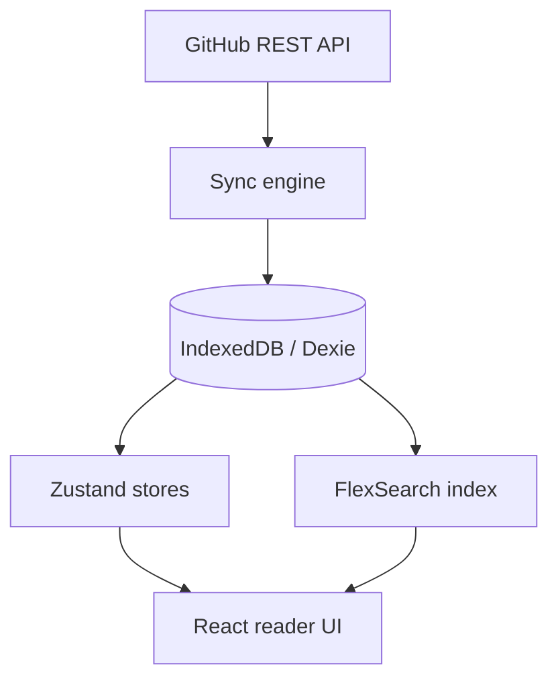
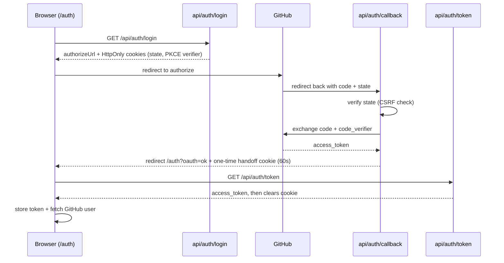

# Obsin

**A local-first web reader for Obsidian vaults stored in GitHub.**

Obsin lets you read, search, and explore your Obsidian notes from any modern browser. GitHub remains the source of truth, while the browser stores a local IndexedDB copy for fast, offline-first reading.

> Status: early open-source project. Obsin is currently **read-first**; editing notes and committing changes back to GitHub is not implemented yet.

[](LICENSE)
[](CONTRIBUTING.md)

## Why Obsin?

Obsidian is excellent on desktop, but reading a GitHub-backed vault from a browser or shared machine can still be awkward. Obsin is built for people who want a simple, installable web reader for their markdown knowledge base.

| Need | Obsin's approach |
|---|---|
| Access notes from any browser | Connect a GitHub-hosted Obsidian vault |
| Fast repeat opens | Cache notes locally in IndexedDB |
| Offline reading | Keep a local browser copy after sync |
| Obsidian-style navigation | Support wiki links, backlinks, folders, tags, and graph view |
| No custom backend database | Use GitHub + browser storage |

## Features

- **GitHub vault sync** — Connect public or private GitHub repositories containing markdown notes.
- **Incremental sync** — Compare remote blob SHAs and only download changed/new markdown files.
- **Ghost-note prevention** — Delete local notes that no longer exist in the remote Git tree.
- **Offline-first reading** — Store notes in IndexedDB through Dexie.
- **Full markdown rendering** — GFM, math via KaTeX, callouts, task lists, headings, and code blocks.
- **Obsidian wiki links** — Resolve `[[Note]]`, `[[Note#heading]]`, and aliases with precomputed maps.
- **Backlinks** — Build backlink tables during sync for quick lookup.
- **Instant search** — In-memory FlexSearch index rebuilt from IndexedDB.
- **Graph view** — D3-powered visualization of note connections.
- **Folder tree, tags, favorites, history** — Reader-focused navigation tools.
- **PWA support** — Installable app shell with service-worker caching.
- **Themes** — Light, dark, and sepia reading modes.

## Screenshots

Screenshots/GIFs are coming soon. Contributions that improve the README visuals are welcome.

## Tech Stack

| Layer | Technology |
|---|---|
| Framework | React 19 + TypeScript |
| Routing | React Router DOM v7 |
| Build | Vite |
| Package manager | Bun |
| Styling | Tailwind CSS v4 |
| State | Zustand |
| Database | Dexie / IndexedDB |
| Search | FlexSearch |
| Markdown | react-markdown, remark-gfm, remark-math, rehype-katex, rehype-slug, custom remark plugins |
| Frontmatter | js-yaml |
| Graph | D3 force-directed layout |
| Auth/API | GitHub REST API + Vercel serverless functions |
| Hosting | Vercel |
| Tests | Vitest where available; `bun run typecheck` is the main correctness gate |

## How it works



The sync engine:

1. Fetches the recursive Git tree for the vault repository.
2. Compares remote blob SHAs with local notes.
3. Downloads only changed/new markdown files with bounded concurrency.
4. Parses frontmatter, headings, tags, aliases, and note body.
5. Deletes local notes missing from the remote tree.
6. Rebuilds wiki-link maps, backlink tables, and the FlexSearch index.
7. Stores sync metadata for future incremental updates.

## OAuth web flow with PKCE

This is the browser-based GitHub OAuth flow used by Obsin. It keeps the client secret off the browser, uses PKCE for the authorization-code exchange, and hands the access token to the app through a short-lived HttpOnly cookie.



Obsin also supports GitHub's device flow and direct Personal Access Token input. A PAT is useful for private repositories or higher rate limits.

## Getting started

### Prerequisites

- [Bun](https://bun.sh/) installed
- Node.js 18+ runtime compatibility
- A GitHub repository containing your Obsidian vault markdown files

### Installation

```bash
git clone https://github.com/shreyansh-singh74/Obsin.git
cd Obsin
bun install
```

### Environment variables

Copy `.env.example` to `.env.local` and fill in the GitHub OAuth values:

```bash
cp .env.example .env.local
```

Required for OAuth/device flow:

```env
VITE_GITHUB_CLIENT_ID=your_github_oauth_client_id
GITHUB_CLIENT_ID=your_github_oauth_client_id
GITHUB_CLIENT_SECRET=your_github_oauth_client_secret
```

Optional:

```env
GITHUB_CALLBACK_URL=http://localhost:3000/api/auth/callback
GITHUB_OAUTH_SCOPE=repo read:user
```

Important security note: `GITHUB_CLIENT_SECRET` must **not** be prefixed with `VITE_`. Vite exposes `VITE_` variables to the browser bundle.

### GitHub OAuth app setup

Create a GitHub OAuth App at:

```text
GitHub → Settings → Developer settings → OAuth Apps → New OAuth App
```

For local development, use:

```text
Homepage URL: http://localhost:3000
Authorization callback URL: http://localhost:3000/api/auth/callback
```

For production on Vercel, use your deployed domain:

```text
Homepage URL: https://your-app.vercel.app
Authorization callback URL: https://your-app.vercel.app/api/auth/callback
```

### Development

```bash
bun run dev
```

Open <http://localhost:3000>.

### Typecheck and build

```bash
bun run typecheck
bun run build
```

### Tests

Some utility/engine tests are available through Vitest:

```bash
bun run test
bun run test:watch
```

When contributing, `bun run typecheck` is the required correctness gate.

## Deploying to Vercel

1. Import the repository into Vercel.
2. Add environment variables:
   - `VITE_GITHUB_CLIENT_ID`
   - `GITHUB_CLIENT_ID`
   - `GITHUB_CLIENT_SECRET`
   - optional `GITHUB_CALLBACK_URL`
   - optional `GITHUB_OAUTH_SCOPE`
3. Set your GitHub OAuth callback URL to:

   ```text
   https://your-app.vercel.app/api/auth/callback
   ```

4. Deploy.

`vercel.json` includes the SPA rewrite, no-store headers for `/api/*`, and a strict Content Security Policy.

## Repository structure

```text
src/
├── components/         React UI components
├── db/                 Dexie schema and repositories
├── engine/             GitHub, sync, markdown, cache, search logic
├── landing/            Marketing/landing page
├── store/              Zustand stores
├── styles/             CSS tokens, themes, typography, animations
├── types/              TypeScript interfaces
└── utils/              Slug/tree/markdown helpers

api/
├── auth/               OAuth login/callback/token handoff functions
└── github/             Device-flow CORS proxy functions
```

## Roadmap

- [ ] Add screenshots and demo GIFs to the README.
- [ ] Improve first-run onboarding for Obsidian users.
- [ ] Add GitHub write-back / quick edit support.
- [ ] Improve mobile reader ergonomics.
- [ ] Add more graph filters and navigation controls.
- [ ] Improve attachment/image handling for complex vaults.
- [ ] Add broader markdown fixture tests.
- [ ] Document common vault setup patterns.

## Security and privacy

- Notes are fetched from GitHub and stored locally in the browser's IndexedDB.
- Serverless auth functions only perform OAuth/device-flow handshakes; they do not persist tokens.
- OAuth token handoff uses short-lived HttpOnly cookies.
- Browser-side tokens are stored locally, so users should protect their device/browser profile.
- For private repositories, prefer the minimum GitHub permissions needed for your vault.

Please report security issues privately. See [SECURITY.md](SECURITY.md).

## Contributing

Contributions from Obsidian users, markdown enthusiasts, and local-first app builders are welcome. See [CONTRIBUTING.md](CONTRIBUTING.md) for setup and PR guidelines.

Good first contributions include docs improvements, markdown edge cases, accessibility fixes, UI polish, and small sync/search bug reports with reproducible examples.

## License

[MIT](LICENSE) © 2026 Obsin
